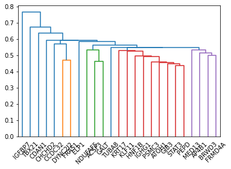

Working with HPOTerms
=====================

.. code-block:: python

   from pyhpo import Ontology

   # initilize the Ontology
   Ontology()

   # Retrieve a term e.g. via its HPO-ID
   term = Ontology.get_hpo_object('Scoliosis')

   print(term)
   #> HP:0002650 | Scoliosis

   # Get information content from Term <--> Omim associations
   term.information_content['omim']
   #> 2.29

   # Show how many genes are associated to the term
   # (Note that this includes indirect associations, associations
   # from children terms to genes.)
   len(term.genes)
   #> 1094

   # Show how many Omim Diseases are associated to the term
   # (Note that this includes indirect associations, associations
   # from children terms to diseases.)
   len(term.omim_diseases)
   #> 844

   # Get a list of all parent terms
   for p in term.parents:
      print(p)
   #> HP:0010674 | Abnormality of the curvature of the vertebral column

   # Get a list of all children terms
   for p in term.children:
      print(p)
   """
   HP:0002944 | Thoracolumbar scoliosis
   HP:0008458 | Progressive congenital scoliosis
   HP:0100884 | Compensatory scoliosis
   HP:0002944 | Thoracolumbar scoliosis
   HP:0002751 | Kyphoscoliosis
   """

Phenotype similarity
====================

Calculate the phenotype similarity between two patients

.. code-block:: python

   from pyhpo import Ontology, HPOSet

   # initilize the Ontology
   Ontology()

   # Declare the clinical information of the patients
   patient_1 = HPOSet.from_queries([
      'HP:0002943',
      'HP:0008458',
      'HP:0100884',
      'HP:0002944',
      'HP:0002751'
   ])

   patient_2 = HPOSet.from_queries([
      'HP:0002650',
      'HP:0010674',
      'HP:0000925',
      'HP:0009121'
   ])

   # and compare their similarity
   patient_1.similarity(patient_2)
   #> 0.7594183905785477

   # use other similarity method
   patient_1.similarity(patient_2, method="resnik")
   #> 0.2345

Clustering of patients
======================
The :class:pyhpo.stats.Linkage` class allows linkage analysis and clustering of patients based on their similarity.

In this example, we're clustering 25 genes based on their associated phenotypes.

.. code-block:: python

   import pyhpo
   from pyhpo import Ontology

   # needed only for plotting the dendogram
   import scipy
   import matplotlib
   %matplotlib inline

   Ontology()
   
   phenotypes = [] # List[HPOSet]
   names = []      # List[str]

   for gene in Ontology.genes[:25]:
      # It's best to calculate the linkage only based on phenotypes and exclude modifier terms
      phenotypes.append(gene.hpo_set().remove_modifier())
      names.append(gene.name)

   # Cluster the diseases using default settings
   lnk = pyhpo.stats.linkage(phenotypes)

   # Print the dendogram using scipy and matplotlib
   plt = scipy.cluster.hierarchy.dendrogram(lnk, labels=names)

   Example dendogram of 25 random genes

Gene-association enrichment
===========================

.. code-block:: python

   from pyhpo import stats, Ontology, HPOSet

   # initilize the Ontology
   Ontology()

   # Declare the clinical information of the patients
   patient_1 = HPOSet.from_queries([
      'HP:0002943',
      'HP:0008458',
      'HP:0100884',
      'HP:0002944',
      'HP:0002751'
   ])

   # Calculate the enrichment of genes in an HPOSet
   gene_model = stats.EnrichmentModel('gene')
   genes = gene_model.enrichment(method='hypergeom', hposet=patient_1)

   print(genes[0])
   # >> {
   # >>     'enrichment': 5.453829934109905e-05,
   # >>     'fold': 33.67884615384615,
   # >>     'count': 3,
   # >>     'item': <Gene (PLOD1)>
   # >> }

Multi-threading features
========================

If you have lots of patients or other sets of terms and want to batchwise operations,
you can benefit from **hpo3** multiprocessing features

Calculate the pairwise similarity of the HPOSets from all genes
---------------------------------------------------------------

.. code-block:: python

   import itertools
   from pyhpo import Ontology, HPOSet, helper

   Ontology()

   gene_sets = [g.hpo_set() for g in Ontology.genes]

   # Create a list of tuples.
   # Each tuple contains the two HPOSets to compare
   # [
   #     (HPOSet, HPOSet),
   #     (HPOSet, HPOSet),
   #     (HPOSet, HPOSet)
   # ]
   gene_set_combinations = [
      (a[0], a[1]) for a in itertools.combinations(gene_sets, 2)
   ]

   similarities = helper.batch_set_similarity(
      gene_set_combinations[0:1000],  # only calculating for for 1000 comparisons to save time
      kind="omim",
      method="graphic",
      combine="funSimAvg"
   )
   # >> [
   # >>     0.40744566917419434,
   # >>     0.1365184634923935,
   # >>     ...
   # >> ]

Calculate the similarity of of a patient's HPO term to all diseases
-------------------------------------------------------------------

.. code-block:: python

   import itertools
   from pyhpo import Ontology, HPOSet, helper

   Ontology()

   patient_1 = HPOSet.from_queries([
      'HP:0002943',
      'HP:0008458',
      'HP:0100884',
      'HP:0002944',
      'HP:0002751'
   ])

   # casting the gene set to a list to main order for later lookups
   genes = list(Ontology.genes)

   # Create a list of tuples.
   # Each tuple contains the patients HPOSet and the HPOSet of a gene
   # [
   #     (HPOSet_Patient, HPOSet_GeneA),
   #     (HPOSet_Patient, HPOSet_GeneB),
   #     (HPOSet_Patient, HPOSet_GeneC)
   # ]
   comparisons = [(patient_1, g.hpo_set()) for g in genes]

   similarities = helper.batch_set_similarity(
      comparisons,
      kind="omim",
      method="graphic",
      combine="funSimAvg"
   )

   # Get most similar gene
   top_score = max(similarities)
   genes[similarities.index(top_score)]
   # >> <Gene (POP1)>

Calculate the disease enrichment for large list of patients
-----------------------------------------------------------
If you have a large list of patients and want to find out which diseases are enriched in each of
them, use the :func:`pyhpo.helper.batch_omim_disease_enrichment` or
:func:`pyhpo.helper.batch_orpha_disease_enrichment` methods.
You can analyze hundreds of patients in seconds.

.. note::

   For the below example we did not use the phenotypes of hundreds of patients.
   Instead we mimic the type of data by converting genes to HPOSets.
   Instead of ``gene_sets``, you could also use a list of HPOSet with patient phenotypes

.. code-block:: python

   import itertools
   from pyhpo import Ontology, helper

   Ontology()

   # casting the gene set to a list to main order for later lookups
   genes = list(Ontology.genes)[:100]  # using only 100 genes in this example
   gene_sets = [g.hpo_set() for g in genes]

   enrichments = helper.batch_omim_disease_enrichment(gene_sets)
   print(f"The most enriched disease for {genes[0]} is {enrichments[0][0]}")

   # >> The most enriched disease for 730 | C7 is {
   # >>     'enrichment': 3.6762699175625894e-42,
   # >>     'fold': 972.9444444444443,
   # >>     'count': 13,
   # >>     'item': <OmimDisease (610102)>
   # >> }

Calculate the gene enrichment for large list of patients
--------------------------------------------------------
If you have a large list of patients and want to find out which genes are enriched in each of
them, use the :func:`pyhpo.helper.batch_gene_enrichment` method.
You can analyze hundreds of patients in seconds.

.. note::

   For the below example we did not use the phenotypes of hundreds of patients.
   Instead we mimic the type of data by converting diseases to HPOSets.
   Instead of ``disease_sets``, you could also use a list of HPOSet with patient phenotypes

.. code-block:: python

   import itertools
   from pyhpo import Ontology, helper

   Ontology()

   # casting the gene set to a list to main order for later lookups
   diseases = list(Ontology.omim_diseases)[:100]  # using only 100 diseases in this example
   disease_sets = [d.hpo_set() for d in diseases]

   enrichments = helper.batch_gene_enrichment(disease_sets)
   print(f"The most enriched gene for {diseases[0]} is {enrichments[0][0]}")

   # >> The most enriched gene for 619510 | Immunodeficiency 85 and autoimmunity is {
   # >>     'enrichment': 7.207370728788139e-45,
   # >>     'fold': 66.0867924528302,
   # >>     'count': 24,
   # >>     'item': <Gene (TOM1)>
   # >> }
